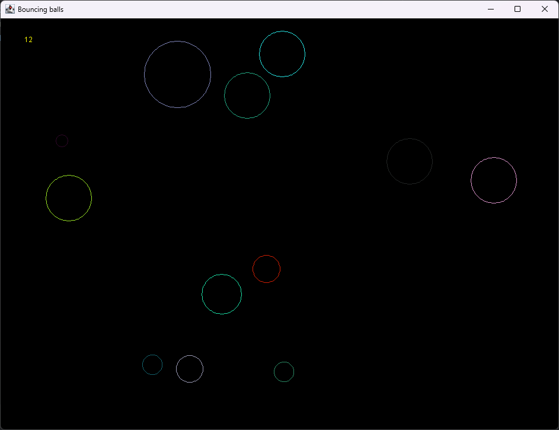
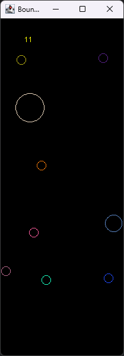

# Bouncing Balls Simulation

 


A Java Swing application that simulates bouncing balls and records their collision coordinates. The project consists of two panels:
1. **Panel:** Simulates bouncing balls and saves collision data to a file.
2. **PanelTwo:** Reads collision data from the file and displays stationary balls.

---

## Table of Contents

- [Features](#features)
- [Screenshots](#screenshots)
- [Installation](#installation)
- [Usage](#usage)
- [How It Works](#how-it-works)
- [Contributing](#contributing)
- [License](#license)
- [Contact](#contact)

---

## Features

- **Dynamic Ball Simulation:** Balls bounce off the walls and each other with randomized speeds.
- **Collision Detection:** Records collision coordinates to a file (`plik.txt`).
- **Interactive Controls:** Add balls by clicking the mouse and adjust their size using the mouse wheel.
- **Static Ball Display:** Reads collision data from the file and displays stationary balls in a separate window.
- **Customizable Ball Properties:** Each ball has a random color and size.

---

## Screenshots

  
*Bouncing balls simulation in action.*

  
*Stationary balls displayed from collision data.*

---

## Installation

To run the project, follow these steps:

1. **Ensure Java is installed:**
   - Download and install Java Development Kit (JDK) from [https://openjdk.org/](https://openjdk.org/).

2. **Clone the repository:**
   ```bash
   git clone https://github.com/M1keEm/BouncingBalls.git

3. **Navigate to the project directory:**
   ```bash
   cd BouncingBalls

4. **Compile and run the app:**
   - To run the bouncing balls simulation:

   ```bash
   javac Window.java
   java Window

   - To run the stationary balls display:
   ```bash
   javac WindowTwo.java
   java WindowTwo
 
 ---
 
## Usage
    
**Bouncing Balls Simulation (Window.java)**
- **Add Balls:** Click anywhere on the panel to add a ball.

- **Adjust Ball Size:** Use the mouse wheel to increase or decrease the size of new balls.

- **Collision Data:** Collision coordinates are saved to plik.txt.

**Stationary Balls Display (WindowTwo.java)**
- **Display Balls:** Launch the application to display balls from the collision data file (plik.txt).

- **Static View:** Balls are displayed at their collision coordinates without movement.

---

## How it works

**Panel (Panel.java)**
- **Ball Creation:** Balls are created with random colors, sizes, and speeds when the user clicks the mouse.

- **Collision Detection:** When two balls collide, their coordinates and sizes are saved to plik.txt.

- **Dynamic Movement:** Balls bounce off the walls and each other, with their speeds updated in real-time.

**PanelTwo (PanelTwo.java)**
- **File Reading:** Reads collision data from plik.txt and creates stationary balls at the recorded coordinates.

- **Static Display:** Displays the balls without movement, providing a visual representation of collision points.

---

## Contributing

Contributions are welcome! If you'd like to contribute to this project, please follow these steps:

1. Fork the repository.
2. Create a new branch (`git checkout -b feature/YourFeatureName`).
3. Commit your changes (`git commit -m 'Add some feature'`).
4. Push to the branch (`git push origin feature/YourFeatureName`).
5. Open a pull request.

Please ensure your code follows the existing style and includes appropriate documentation.

---

## License

This project is licensed under the MIT License. See the [LICENSE](LICENSE) file for details.

---

## Contact

If you have any questions or suggestions, feel free to reach out:

- **MikeEm** - [My Github](https://github.com/m1keem)
- **Project Link** - [Repository](https://github.com/m1keem/bouncingballs)
